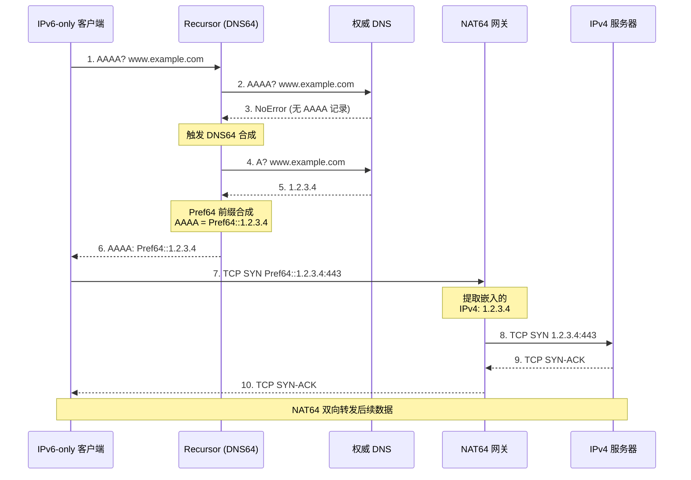
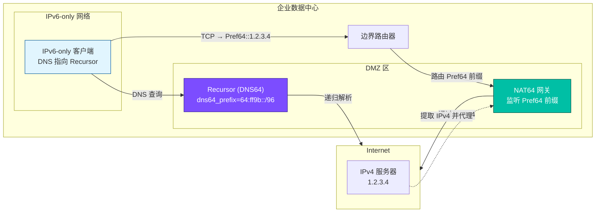

# PowerDNS Recursor — DNS64 支持

> 来源: https://doc.powerdns.com/recursor/dns64.html
---

DNS64 (RFC 6147) 使 IPv6-only 客户端通过合成 AAAA 记录访问仅有 IPv4 地址的服务器。
NAT64 网关负责在实际传输中完成 IPv6 ↔ IPv4 转换。

---

## 一、DNS64 工作原理

当 IPv6-only 客户端查询 `www.example.com` 的 AAAA 记录但目标只有 A 记录时：

1. Recursor 查询 AAAA 记录，获得 NoError 但无实际答案（NODATA）
2. Recursor 自动查询 A 记录，获得 IPv4 地址
3. Recursor 使用配置的 `Pref64` 前缀合成 AAAA 地址并返回
4. NAT64 网关接收 IPv6 流量，提取嵌入的 IPv4 地址并代理转发



---

## 二、原生 DNS64 (≥4.4.0)

自 4.4.0 起内置高效 DNS64 实现，只需设置前缀即可启用。

### 配置

```yaml
recursor:
  dns64_prefix: '64:ff9b::/96'
```

### 触发条件（全部满足才生效）

| 条件 | 说明 |
|------|------|
| `recursor.dns64_prefix` 已设置 | 前缀配置不能为空 |
| Lua `nodata`/`nxdomain` hook 未返回 `true` | Lua 脚本可以抢占 DNS64 处理 |
| 原始查询类型为 `AAAA` | 仅对 AAAA 查询生效 |
| AAAA 查询结果非 `NXDomain` | NXDOMAIN 表示域名不存在，不应合成 |
| 无有效 AAAA 应答 | NoError + 无记录，或非 NXDomain 错误 |
| DNSSEC 验证非 Bogus | 验证失败的不做 DNS64 |

> **注意**: 4.8.0 之前仅 `NoError` 结果参与 DNS64 处理。4.8.0 起非 NXDomain 错误也被考虑。

### 处理顺序

DNS64 处理发生在以下 Lua hook 调用顺序中：

```
Lua nodata/nxdomain hook (如有定义)
    ↓
原生 DNS64 处理
    ↓
Lua postresolve/postresolve_ffi hook (如有定义)
```

如果 Lua `nodata` 或 `nxdomain` hook 返回 `true`，DNS64 处理被**跳过**。

---

## 三、脚本化 DNS64（Lua，最大灵活性）

对于 4.4.0 之前的版本或需要更复杂逻辑的场景（如根据客户端位置返回不同 NAT64 网关），可使用 Lua 脚本实现。

### 基础脚本: 正向 + 反向

```lua
-- dns64.lua — 基础 DNS64 实现（含正向 AAAA 合成和反向 PTR）

-- Pref64 前缀 (根据实际 NAT64 网关配置修改)
prefix = "fe80::21b:77ff:0:0"

-- 正向 DNS64: NODATA 时合成 AAAA
function nodata(dq)
  -- 仅处理 AAAA 查询
  if dq.qtype ~= pdns.AAAA then
    return false
  end

  -- DNSSEC 验证失败的不做 DNS64
  if dq.validationState == pdns.validationstates.Bogus then
    return false
  end

  -- 启动 followup: 查 A 记录后合成 AAAA
  dq.followupFunction = "getFakeAAAARecords"
  dq.followupPrefix = prefix
  dq.followupName = dq.qname
  return true
end

-- 反向 DNS64: PTR 查询映射到对应 IPv4 PTR
function preresolve(dq)
  -- Pref64 前缀的反向 arpa 格式
  -- fe80::21b:77ff:0:0 → f.f.7.7.b.1.2.0...8.e.f.ip6.arpa
  local reversed_prefix = newDN(
    "f.f.7.7.b.1.2.0.0.0.0.0.0.0.0.0.0.0.0.0.0.0.8.e.f.ip6.arpa."
  )

  if dq.qtype == pdns.PTR and dq.qname:isPartOf(reversed_prefix) then
    dq.followupFunction = "getFakePTRRecords"
    dq.followupPrefix = prefix
    dq.followupName = dq.qname
    return true
  end

  return false
end
```

### 启用脚本

```yaml
recursor:
  lua_dns_script: /etc/powerdns/dns64.lua
```

### 多前缀脚本

对于需要多个 Pref64 前缀的场景（如不同客户端网段走不同 NAT64 网关），参考社区示例：
https://github.com/PowerDNS/pdns/wiki/DNS64-with-multiple-prefixes

---

## 四、常用 Pref64 前缀

| 前缀 | 说明 |
|------|------|
| `64:ff9b::/96` | RFC 6052 知名前缀 (Well-Known Prefix) ★推荐 |
| `64:ff9b:1::/48` | RFC 8215 本地前缀 |
| 自定义 `/96` | 企业内部自定义前缀 |

> **注意**: `recursor.dns64_prefix` 必须是 `/96` 前缀，因为 IPv4 地址被嵌入到最后 32 位。

---

## 五、原生 vs 脚本化

| 特性 | 原生 DNS64 | 脚本化 DNS64 |
|------|-----------|-------------|
| 配置复杂度 | 1 行 YAML | Lua 脚本 |
| 性能 | 最优（C++ 内建） | 稍低（Lua 调用开销） |
| 多前缀支持 | 不支持 | ✅ |
| 按客户端选择前缀 | 不支持 | ✅ |
| PTR 合成 | 自动 | 需手动实现 |
| 自定义逻辑 | 不支持 | ✅ |
| 最低版本 | 4.4.0 | 任意版本 |

---

## 六、与 DNSSEC 的交互

- **Bogus 验证**: 如果 AAAA 查询 DNSSEC 结果为 Bogus，原生 DNS64 **不会**合成
- **验证通过**: DNSSEC 验证通过的合成 AAAA 记录会被客户端信任
- **NTA (否定信任锚点)**: 如果目标域因 DNSSEC 配置错误导致 Bogus，添加 NTA 可让 DNS64 生效

---

## 七、排查

```bash
# 测试 DNS64 合成
dig @127.0.0.1 AAAA ipv4only.example.com

# 查看是否返回了 Pref64 前缀的地址
# 预期: 返回 64:ff9b::x.x.x.x 格式的 AAAA 记录

# 如果未合成，检查:
# 1. dns64_prefix 是否设置
# 2. 目标域名是否确实无 AAAA 但有 A 记录
# 3. DNSSEC 验证状态
# 4. Lua hook 是否拦截了处理
```

---

## 八、完整 DNS64 + NAT64 部署示例


