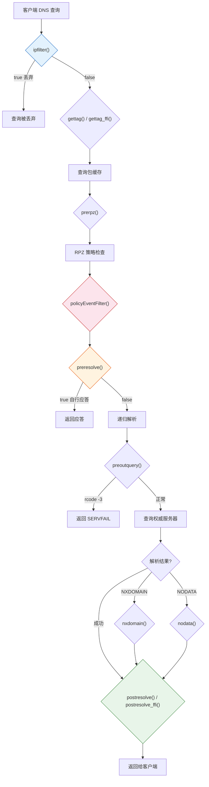

# PowerDNS Recursor — Lua 脚本编程

> 来源: https://doc.powerdns.com/recursor/lua-scripting/index.html
> 相关文档: [DNS64](powerdns-recursor-dns64.md)、[配置参数参考](powerdns-recursor-settings-reference.md)

---

PowerDNS Recursor 支持使用 Lua 脚本修改解析行为，用于负载均衡、域名拦截、策略控制、
DNS64、安全过滤等。Lua 极其轻量快速，可支撑数十万 QPS。LuaJIT 也受支持。

> **重要**: Recursor 使用协作式用户态多线程，Lua 中**禁止**调用阻塞函数，否则会独占
> worker 线程导致服务中断。

---

## 一、Hook 拦截流程



---

## 二、Hook 函数详解

### 2.1 ipfilter(remoteip, localip, dh) → bool

**最早**被调用的 hook（在包缓存查找之后、DNS 包解析之前）。用于**极速丢弃**不需要的流量。

| 参数 | 类型 | 说明 |
|------|------|------|
| remoteip | ComboAddress | 客户端 IP |
| localip | ComboAddress | 查询到达的本地 IP |
| dh | DNSHeader | DNS 头部（可检查 AD/AA/ID 等） |

> 注意：此 hook **不获取**完整的 `dq` 对象，因为要避免包解析。

```lua
badips = newNMG()
badips:addMask("1.2.3.0/24")

function ipfilter(rem, loc, dh)
    -- 丢弃 1.2.3.0/24 的查询或 AD 位设置的查询
    return badips:match(rem) or dh:getAD()
end
```

### 2.2 gettag(remote, ednssubnet, localip, qname, qtype, ednsoptions, tcp, proxyprotocolvalues) → tag, [policyTags, data, reqId, deviceId, deviceName, routingTag]

在包缓存查找**之前**调用，用于将查询分配到特定包缓存分区。

| 返回值 | 类型 | 说明 |
|------|------|------|
| tag | int | 包缓存分区号（0~2^32-1），默认 0 |
| policyTags | table | 策略标签表 |
| data | table | 自定义数据（可在其他 hook 中访问 `dq.data`） |
| requestorId | string | 请求者 ID |
| deviceId | string | 设备 ID |
| deviceName | string | 设备名 |
| routingTag | string | 路由标签（用于记录缓存分区） |

> 需要 `incoming.gettag_needs_edns_options=true` 才能获取 `ednsoptions`。

```lua
function gettag(remote, ednssubnet, localip, qname, qtype, ednsoptions, tcp)
    -- 按客户端子网分区缓存
    if ednssubnet then
        return tonumber(ednssubnet:getNetwork():toString():match("(%d+)%.")) or 0
    end
    return 0
end
```

### 2.3 gettag_ffi(param) → Lua object or nil

`gettag()` 的 FFI (Foreign Function Interface) 版本，性能更高。通过 FFI accessor 函数操作参数。

### 2.4 prerpz(dq) → bool

在 RPZ 策略检查**之前**调用。可选择性禁用特定策略。

```lua
function prerpz(dq)
    -- 对 example.com 禁用 malware 策略
    if dq.qname:equal("example.com") then
        dq:discardPolicy("malware")
    end
    return false
end
```

### 2.5 preresolve(dq) → bool

在 DNS 解析**之前**调用。最常用的 hook，可直接构造应答。

- `true` — 已处理查询，Recursor 直接返回
- `false` — 继续正常解析流程

```lua
function preresolve(dq)
    if dq.qname:equal("blocked.example.com") then
        dq:addAnswer(pdns.A, "0.0.0.0")      -- 返回黑洞 IP
        dq.rcode = 0
        return true
    end
    return false
end
```

### 2.6 postresolve(dq) → bool

在**应答返回给客户端之前**调用（以及在写入包缓存之前）。可检查和修改应答。

```lua
function postresolve(dq)
    local records = dq:getRecords()
    for k, v in pairs(records) do
        if v.type == pdns.A and v:getContent() == "1.2.3.4" then
            v:changeContent("10.0.0.1")   -- 改写特定 IP
            v.ttl = 60
        end
    end
    dq:setRecords(records)
    return true
end
```

### 2.7 postresolve_ffi(handle) → bool

`postresolve()` 的 FFI 版本，性能更高。

### 2.8 nxdomain(dq) → bool

当解析结果为 **NXDOMAIN**（域名不存在）时调用。

```lua
function nxdomain(dq)
    -- NXDOMAIN 重定向（谨慎使用！）
    if dq.qname:isPartOf(newDN("com")) then
        dq.rcode = 0
        dq:addAnswer(pdns.CNAME, "search.example.com")
        return true
    end
    return false
end
```

### 2.9 nodata(dq) → bool

当域名存在但**请求类型不存在**（NODATA）时调用。**DNS64 的实现位置**。

### 2.10 preoutquery(dq) → bool

在向权威服务器**发出查询之前**调用（不是对客户端查询的响应）。

- 设置 `dq.rcode = -3` 可终止整个客户端查询（返回 SERVFAIL）
- 也可像 preresolve() 一样直接返回记录

> 注意：此 hook 中只有 `dq.remoteaddr`（目标 NS）、`dq.localaddr`（原始客户端）、`dq.qname`、`dq.qtype`、`dq.isTcp` 字段可用。

```lua
lethalgroup = newNMG()
lethalgroup:addMask("192.121.121.0/24")

function preoutquery(dq)
    -- 如果目标 NS 在黑名单中，终止查询
    if lethalgroup:match(dq.remoteaddr) then
        dq.rcode = -3
        return true
    end
    return false
end
```

### 2.11 policyEventFilter(event) → bool

RPZ 策略命中后、执行前调用。

- `true` — 忽略该策略命中（恢复正常解析）
- `false` — 应用策略（可能已修改）

```lua
function policyEventFilter(event)
    if event.qname:equal("example.com") then
        -- 将命中改为自定义 CNAME
        event.appliedPolicy.policyKind = pdns.policykinds.Custom
        event.appliedPolicy.policyCustom = "example.net"
        return false
    end
    return false
end
```

### 2.12 maintenance()

周期性维护回调（≥4.2）。无参数、无返回值。间隔由 `recursor.lua_maintenance_interval` 控制（默认 1 秒）。

```lua
function maintenance()
    -- 每小时执行一次
    if os.time() % 3600 == 0 then
        pdnslog("Hourly maintenance running")
    end
end
```

---

## 三、回调语义汇总

| Hook | 返回 true 的含义 | 返回 false 的含义 |
|------|-----------------|------------------|
| `ipfilter()` | 丢弃查询 | 继续处理 |
| `gettag()` | (返回 tag 编号) | 异常时 tag=0 |
| `prerpz()` | 忽略（当前版本） | 忽略（当前版本） |
| `preresolve()` | 已自行处理查询 | 继续正常解析 |
| `postresolve()` | 已修改应答 | 未修改 |
| `nxdomain()` | 已修改 NXDOMAIN | 不修改 |
| `nodata()` | 已修改 NODATA | 不修改 |
| `preoutquery()` | 已处理（rcode=-3 终止） | 正常出站 |
| `policyEventFilter()` | **忽略**该策略 | **应用**策略 |
| `postresolve_ffi()` | 已修改应答 | 未修改 |

---

## 四、丢弃 vs 策略丢弃

**≤4.3:** 设置 `dq.rcode = pdns.DROP`，返回 `true`

**≥4.4:** 推荐策略方式（计入 `policy-drops` 指标）

```lua
function nxdomain(dq)
    if dq.qtype == pdns.A then
        dq.appliedPolicy.policyKind = pdns.policykinds.Drop
        return false  -- 注意: 返回 false！让 Recursor 处理 Drop 动作
    end
    return false
end
```

---

## 五、Follow-up Actions（后续操作）

设置 `dq.followupFunction` 让 Recursor 执行额外操作：

### 5.1 CNAME 链解析 `"followCNAMERecords"`

```lua
function preresolve(dq)
    dq:addAnswer(pdns.CNAME, "target.example.com.")
    dq.rcode = 0
    dq.followupFunction = "followCNAMERecords"  -- Recursor 将解析此 CNAME
    return true
end
```

### 5.2 DNS64 `"getFakeAAAARecords"` / `"getFakePTRRecords"`

```lua
function nodata(dq)
    if dq.qtype == pdns.AAAA then
        dq.followupFunction = "getFakeAAAARecords"
        dq.followupName = dq.qname
        dq.followupPrefix = "64:ff9b::"
        return true
    end
    return false
end
```

### 5.3 UDP 异步查询 `"udpQueryResponse"`

向外部键值存储发起异步 UDP 查询，不阻塞 worker 线程：

```lua
function preresolve(dq)
    dq.followupFunction = "udpQueryResponse"
    dq.udpCallback = "gotResult"                  -- 回调函数名
    dq.udpQueryDest = newCA("127.0.0.1:5555")     -- 目标地址
    dq.udpQuery = "LOOKUP " .. dq.qname:toString() -- 查询内容
    return true
end

function gotResult(dq)
    -- dq.udpAnswer 包含 UDP 响应
    if dq.udpAnswer == "block" then
        dq:addAnswer(pdns.A, "0.0.0.0")
        return true
    end
    dq.followupFunction = ""
    return false  -- 恢复正常解析
end
```

---

## 六、策略类型 (policykinds)

| 值 | 含义 |
|------|------|
| `pdns.policykinds.NoAction` | 不采取行动 |
| `pdns.policykinds.Drop` | 丢弃查询 |
| `pdns.policykinds.NXDOMAIN` | 返回域名不存在 |
| `pdns.policykinds.NODATA` | 返回无数据 |
| `pdns.policykinds.Truncate` | 返回截断 |
| `pdns.policykinds.Custom` | 自定义响应（需设 `policyCustom`） |

---

## 七、核心数据类

### 7.1 DNSName — 域名对象

```lua
-- 创建
d = newDN("www.example.com")

-- 比较（大小写不敏感，自动处理尾随点）
d:equal("www.example.com.")  -- true

-- 后缀匹配
d:isPartOf(newDN("example.com"))  -- true

-- 转为字符串
d:toString()  -- "www.example.com."
```

### 7.2 DNS Suffix Match Group (DS)

```lua
blockset = newDS()
blockset:add{"evil.com", "malware.net"}

if blockset:check(dq.qname) then
    -- 匹配
end
```

### 7.3 ComboAddress — IP 地址

```lua
addr = newCA("192.168.1.1")
addr = newCA("192.168.1.1:53")
addr:toString()           -- "192.168.1.1"
addr:toStringWithPort()   -- "192.168.1.1:53"
addr:getPort()
addr:equal(newCA("127.0.0.1"))
```

### 7.4 Netmask / NetMaskGroup

```lua
-- 单个网段
nm = newNetmask("192.168.0.0/16")
nm:match(newCA("192.168.1.1"))  -- true

-- 网段组
badips = newNMG()
badips:addMask("10.0.0.0/8")
badips:addMasks({"172.16.0.0/12", "192.168.0.0/16"})

if badips:match(dq.remoteaddr) then
    -- 匹配
end
```

### 7.5 DNSRecord — 操作应答记录

```lua
-- 添加一条 A 记录
dq:addAnswer(pdns.A, "192.168.1.1")
dq:addAnswer(pdns.A, "192.168.1.1", 3600)           -- 带 TTL
dq:addAnswer(pdns.CNAME, "target.com.", 3600, "name") -- 指定名称

-- 添加 TXT 记录
dq:addAnswer(pdns.TXT, '"v=spf1 -all"', 600)

-- 遍历修改
local records = dq:getRecords()
for k, v in pairs(records) do
    v.name:toString()    -- 记录名
    v.type               -- pdns.A, pdns.AAAA 等
    v:getContent()       -- 记录值
    v.ttl                -- TTL
    v:changeContent("new_value")
end
dq:setRecords(records)
```

### 7.6 常用 QType 常量

| 常量 | 值 | 常量 | 值 |
|------|-----|------|-----|
| `pdns.A` | 1 | `pdns.AAAA` | 28 |
| `pdns.CNAME` | 5 | `pdns.MX` | 15 |
| `pdns.TXT` | 16 | `pdns.PTR` | 12 |
| `pdns.SOA` | 6 | `pdns.NS` | 2 |
| `pdns.SRV` | 33 | `pdns.ANY` | 255 |

---

## 八、Lua 脚本配置

### 8.1 启用脚本

```yaml
recursor:
  lua_dns_script: '/etc/powerdns/recursor.lua'
  lua_maintenance_interval: 1            # maintenance() 调用间隔（秒）
  lua_global_include_dir: '/etc/pdns/lua-global/'  # 全局 Lua include 目录
  lua_start_stop_script: '/etc/pdns/startup.lua'   # 启动/停止脚本（≥5.2）
```

`lua_global_include_dir` 中所有 `*.lua` 文件会被加载到每个 Lua 上下文中。

### 8.2 热重载

```bash
# 重新加载 Lua 脚本（不中断服务）
rec_control reload-lua-config
# 或 ≥5.2
rec_control reload-yaml
```

---

## 九、日志与统计

### 9.1 从 Lua 日志

```lua
-- 基本日志
pdnslog("Processing query for " .. dq.qname:toString())

-- 指定级别
pdnslog("Critical issue!", pdns.loglevels.Error)     -- 3
pdnslog("Warning", pdns.loglevels.Warning)           -- 4
pdnslog("Notice", pdns.loglevels.Notice)             -- 5
pdnslog("Info", pdns.loglevels.Info)                 -- 6
pdnslog("Debug detail", pdns.loglevels.Debug)        -- 7
```

### 9.2 自定义指标

```lua
-- 创建计数器
magicMetric = getMetric("magic-queries")

function preresolve(dq)
    if dq.qname:equal("magic.com") then
        magicMetric:inc()  -- 递增
    end
    return false
end
```

指标会出现在 `rec_control get-all` 和 Prometheus 输出中（前缀 `pdns_recursor_`）。

---

## 十、SNMP Trap

```lua
function preresolve(dq)
    if dq.qname:equal("attack.example.com") then
        sendCustomSNMPTrap('Potential attack from ' .. dq.remoteaddr:toString())
    end
    return false
end
```

需编译 SNMP 支持并设置 `snmp.agent=true`。

---

## 十一、完整示例脚本

```lua
-- ============================================================
-- PowerDNS Recursor 企业 Lua 脚本示例
-- ============================================================

pdnslog("Enterprise Lua script loaded", pdns.loglevels.Warning)

-- ====== 初始化 ======

-- 域名黑名单（直接拦截）
blocklist = newDS()
blocklist:add{"evil.com", "malware.net", "phishing.org"}

-- 域名丢弃列表（不响应）
droplist = newDS()
droplist:add("forbidden.cn")

-- CNAME 重定向列表
redirectlist = {}
redirectlist[newDN("ads.example.com")] = "blocked.internal.com"

-- IP 黑名单（直接丢弃）
ipblacklist = newNMG()
ipblacklist:addMask("10.255.255.0/24")

-- 权威服务器黑名单（禁止查询这些 NS）
badnslist = newNMG()
badnslist:addMask("192.121.121.0/24")

-- 自定义指标
blockedMetric = getMetric("blocked-queries")
droppedMetric = getMetric("dropped-queries")
nxdomainRedirectMetric = getMetric("nxdomain-redirects")

-- ====== ipfilter — 最快速丢弃 ======
function ipfilter(rem, loc, dh)
    return ipblacklist:match(rem)
end

-- ====== preresolve — 查询拦截 ======
function preresolve(dq)
    -- 域名黑名单 → 返回黑洞 IP
    if blocklist:check(dq.qname) then
        blockedMetric:inc()
        if dq.qtype == pdns.A then
            dq:addAnswer(pdns.A, "0.0.0.0")
            dq.rcode = 0
            return true
        elseif dq.qtype == pdns.AAAA then
            dq:addAnswer(pdns.AAAA, "::")
            dq.rcode = 0
            return true
        end
    end

    -- 域名丢弃列表
    if droplist:check(dq.qname) then
        droppedMetric:inc()
        dq.appliedPolicy.policyKind = pdns.policykinds.Drop
        return false
    end

    -- CNAME 重定向
    for pattern, target in pairs(redirectlist) do
        if dq.qname:isPartOf(pattern) then
            dq:addAnswer(pdns.CNAME, target)
            dq.rcode = 0
            dq.followupFunction = "followCNAMERecords"
            return true
        end
    end

    return false
end

-- ====== preoutquery — 保护权威服务器 ======
function preoutquery(dq)
    if badnslist:match(dq.remoteaddr) then
        dq.rcode = -3   -- 终止查询
        return true
    end
    return false
end

-- ====== nxdomain — NXDOMAIN 重定向 ======
function nxdomain(dq)
    nxdomainRedirectMetric:inc()
    -- 这里可以决定是否重定向或记录
    return false
end

-- ====== maintenance — 定期维护 ======
function maintenance()
    -- 例如：每小时刷新本地缓存等
end
```

---

## 十二、常用 RCode 常量

| 常量 | 值 | 含义 |
|------|-----|------|
| `pdns.NOERROR` | 0 | 无错误 |
| `pdns.FORMERR` | 1 | 格式错误 |
| `pdns.SERVFAIL` | 2 | 服务器失败 |
| `pdns.NXDOMAIN` | 3 | 域名不存在 |
| `pdns.NOTIMP` | 4 | 未实现 |
| `pdns.REFUSED` | 5 | 拒绝 |

---

## 参考资料

- [官方示例脚本](https://github.com/PowerDNS/pdns/blob/master/pdns/recursordist/contrib/powerdns-example-script.lua)
- [Programming in Lua](https://www.amazon.com/exec/obidos/ASIN/859037985X/lua-pilindex-20)
- [Learn Lua in 15 Minutes](https://tylerneylon.com/a/learn-lua/)
- [LuaJIT](https://luajit.org/)
