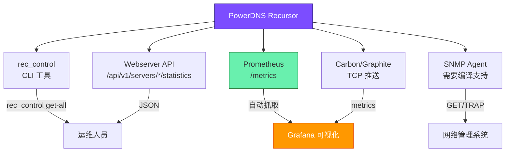

# PowerDNS Recursor — 指标与统计

> 来源: https://doc.powerdns.com/recursor/metrics.html
> 相关文档: [配置参数参考](powerdns-recursor-settings-reference.md)、[性能调优指南](powerdns-recursor-performance-guide.md)

---

Recursor 内置丰富的统计指标，可通过多种接口获取，用于监控、告警和性能分析。

---

## 一、获取指标的方式



### 1.1 rec_control

```bash
# 获取所有指标
rec_control get-all

# 获取单个指标
rec_control get all-outqueries
rec_control get questions
rec_control get cache-hits
```

### 1.2 Webserver API (JSON)

```bash
# 通过 REST API
curl -H 'X-API-Key: your-key' http://127.0.0.1:8082/api/v1/servers/localhost/statistics
```

### 1.3 Prometheus (推荐 ★)

```bash
# Prometheus 格式端点
curl http://127.0.0.1:8082/metrics
```

输出示例：
```
# HELP pdns_recursor_all_outqueries Number of outgoing UDP queries since starting
# TYPE pdns_recursor_all_outqueries counter
pdns_recursor_all_outqueries 7
```

命名规则：`pdns_recursor_` + 指标名（连字符替换为下划线）。

### 1.4 Carbon / Graphite

```yaml
carbon:
  server: ['10.0.0.100:2004']
  interval: 30
  ns: 'pdns'
  ourname: 'ns1'
  instance: 'recursor'
```

指标命名格式: `pdns.<ourname>.recursor.<metric>`

示例: `pdns.ns1.recursor.questions`

> **注意**: 如果主机名包含点号，会被替换为下划线。但如果手动设置 `carbon.ourname`，不会做替换。

### 1.5 SNMP

```yaml
snmp:
  agent: true
  daemon_socket: ''
```

完整 MIB 定义: [RECURSOR-MIB.txt](https://github.com/PowerDNS/pdns/blob/master/pdns/recursordist/RECURSOR-MIB.txt)

---

## 二、定期统计日志

每 `logging.statistics_interval` 秒（默认 1800 秒 = 30 分钟）输出一行统计摘要。
发送 `SIGUSR1` 信号可强制输出现有统计：

```bash
kill -SIGUSR1 $(pidof pdns_recursor)
```

### 日志解读

```
stats: 346362 questions, 7388 cache entries, 1773 negative entries, 18% cache hits
stats: cache contended/acquired 1583/56041728 = 0.00282468%
stats: throttle map: 3, ns speeds: 1487, failed ns: 15, ednsmap: 1363
stats: outpacket/query ratio 54%, 0% throttled, 0 no-delegation drops
stats: 217 outgoing tcp connections, 0 queries running, 9155 outgoing timeouts
stats: 4536 packet cache entries, 82% packet cache hits
stats: thread 0 has been distributed 175728 queries
stats: thread 1 has been distributed 169484 queries
stats: 1 qps (average over 1800 seconds)
```

| 字段 | 值 | 含义 |
|------|-----|------|
| questions | 346362 | 收到的查询总数 |
| cache entries | 7388 | 记录缓存中不同 name/type 组合数 |
| negative entries | 1773 | 否定缓存条目数（已知不存在的域名） |
| cache hits | 18% | 记录缓存命中率（不含包缓存） |
| outpacket/query ratio | 54% | 平均每次查询需要的出站包数 |
| outgoing tcp connections | 217 | 出站 TCP 连接数 |
| outgoing timeouts | 9155 | 出站查询超时次数 |
| packet cache entries | 4536 | 包缓存条目数 |
| packet cache hits | 82% | 包缓存命中率 |
| qps | 1 | 过去 1800 秒的平均 QPS |

---

## 三、指标分类速查

### 3.1 核心 QPS 指标

| 指标 | SNMP | 说明 |
|------|------|------|
| `questions` | (1) | 客户端查询总数（RD 位设置） |
| `ipv6-questions` | (2) | IPv6 客户端查询数 |
| `tcp-questions` | (3) | TCP 客户端查询数 |
| `all-outqueries` | (59) | 出站 UDP 查询总数 |
| `ipv6-outqueries` | (60) | 出站 IPv6 查询数 |
| `tcp-outqueries` | (58) | 出站 TCP 查询数 |
| `dot-outqueries` | (113) | 出站 DoT 查询数 |
| `dont-outqueries` | (62) | 被 dont-query 规则阻止的查询数 |
| `throttled-outqueries` | (61) | 被限流的出站查询数 |
| `noedns-outqueries` | (74) | 不带 EDNS 的出站查询数 |
| `noping-outqueries` | (73) | 不带 ping 的出站查询数 |

### 3.2 QPS 守恒公式

```
answers0-1 + answers1-10 + answers10-100 + answers100-1000
  + answers-slow + packetcache-hits + over-capacity-drops + policy-drops
  = questions
```

> **注意**: `unauthorized-tcp` 和 `unauthorized-udp` 不计入 `questions`。

### 3.3 应答延迟分布

| 指标 | SNMP | 说明 |
|------|------|------|
| `answers0-1` | (22) | < 1ms 应答数 |
| `answers1-10` | (23) | 1~10ms 应答数 |
| `answers10-100` | (24) | 10~100ms 应答数 |
| `answers100-1000` | (25) | 100~1000ms 应答数 |
| `answers-slow` | (26) | > 1000ms 应答数 |

**按 IPv4/IPv6 细分:**
`auth4-answers0-1` ~ `auth4-answers-slow` (27-31)
`auth6-answers0-1` ~ `auth6-answers-slow` (32-36)

**Recursor 内部耗时分布 (实验性):**
| 指标 | 范围 |
|------|------|
| `x-ourtime0-1` | 0~1ms |
| `x-ourtime1-2` | 1~2ms |
| `x-ourtime2-4` | 2~4ms |
| `x-ourtime4-8` | 4~8ms |
| `x-ourtime8-16` | 8~16ms |
| `x-ourtime16-32` | 16~32ms |
| `x-ourtime-slow` | > 32ms |

### 3.4 缓存指标

| 指标 | SNMP | 说明 |
|------|------|------|
| `cache-entries` | (6) | 记录缓存条目数 |
| `cache-hits` | (4) | 记录缓存命中 |
| `cache-misses` | (5) | 记录缓存未命中 |
| `negcache-entries` | (49) | 否定缓存条目数 |
| `packetcache-entries` | (10) | 包缓存条目数 |
| `packetcache-hits` | (8) | 包缓存命中 |
| `packetcache-misses` | (9) | 包缓存未命中 |
| `packetcache-bytes` | (11) | 包缓存大小（字节，当前为 0） |
| `packetcache-acquired` | (146) | 包缓存锁获取次数 |
| `packetcache-contended` | (145) | 包缓存锁竞争次数 |
| `record-cache-acquired` | (103) | 记录缓存锁获取次数 |
| `record-cache-contended` | (102) | 记录缓存锁竞争次数 |
| `cache-bytes` | (7) | 记录缓存大小（≥5.3，禁用默认） |

### 3.5 DNSSEC 指标

| 指标 | SNMP | 说明 |
|------|------|------|
| `dnssec-queries` | (72) | DNSSEC 查询数 |
| `dnssec-validations` | (80) | 请求验证的次数 |
| `dnssec-result-secure` | (82) | Secure 结果 |
| `dnssec-result-insecure` | (81) | Insecure 结果 |
| `dnssec-result-bogus` | (83) | Bogus 结果 |
| `dnssec-result-indeterminate` | (84) | 无法确定 |
| `dnssec-result-nta` | (85) | 否定信任锚点命中 |
| `dnssec-authentic-data-queries` | (95) | AD 位查询数 |
| `dnssec-check-disabled-queries` | (96) | CD 位查询数 |

**Bogus 细分原因:**
`dnssec-result-bogus-invalid-denial`、`dnssec-result-bogus-no-rrsig`、
`dnssec-result-bogus-no-valid-dnskey`、`dnssec-result-bogus-signature-expired`、
`dnssec-result-bogus-signature-not-yet-valid`、`dnssec-result-bogus-unsupported-dnskey-algo` 等

> 以 `x-dnssec-result-*` 前缀的指标是 `dnssec.x_dnssec_names` 中指定域名的独立统计。

### 3.6 连接/安全指标

| 指标 | SNMP | 说明 |
|------|------|------|
| `unauthorized-tcp` | (17) | 未授权 TCP 查询 |
| `unauthorized-udp` | (16) | 未授权 UDP 查询 |
| `tcp-clients` | (65) | 当前 TCP 客户端数 |
| `tcp-client-overflow` | (18) | TCP 客户端连接被拒绝 |
| `tcp-overflow` | (152) | TCP 入站限制达到 |
| `no-packet-error` | (45) | socket 就绪但无包 |
| `ignored-packets` | (47) | 被忽略的包 |
| `unexpected-packets` | (38) | 未预期的包 |
| `client-parse-errors` | (19) | 客户端解析错误 |
| `server-parse-errors` | (20) | 服务器解析错误 |

### 3.7 资源/超时指标

| 指标 | SNMP | 说明 |
|------|------|------|
| `concurrent-queries` | (53) | 当前并发查询数 |
| `over-capacity-drops` | (43) | 超容量丢弃 |
| `too-old-drops` | (21) | 超时丢弃 |
| `outgoing-timeouts` | (55) | 出站超时总数 |
| `outgoing4-timeouts` | (56) | 出站 IPv4 超时 |
| `outgoing6-timeouts` | (57) | 出站 IPv6 超时 |
| `resource-limits` | (42) | 资源限制触发数 |
| `chain-limits` | (151) | 链限制触发数 |
| `query-pipe-full-drops` | (92) | 查询管道满丢弃 |
| `truncated-drops` | (93) | 大于 512 字节被丢弃 |

### 3.8 系统/CPU 指标

| 指标 | SNMP | 说明 |
|------|------|------|
| `user-msec` | (78) | 用户态 CPU 时间 (ms) |
| `sys-msec` | (79) | 内核态 CPU 时间 (ms) |
| `uptime` | (75) | 进程运行时间 (秒) |
| `real-memory-usage` | (76) | 内存使用 |
| `special-memory-usage` | (98) | 精确内存使用（昂贵） |
| `fd-usage` | (77) | 文件描述符使用数 |
| `max-mthread-stack` | (48) | mthread 栈最大使用量 |

### 3.9 其它指标

| 指标 | SNMP | 说明 |
|------|------|------|
| `qa-latency` | (37) | 加权平均延迟 (μs) |
| `nod-events` | (147) | NOD 事件数 |
| `udr-events` | (148) | UDR 事件数 |
| `policy-result-drop` | (87) | 策略丢弃计数 |
| `policy-result-nxdomain` | (88) | 策略 NXDOMAIN 计数 |
| `policy-result-nodata` | (89) | 策略 NODATA 计数 |
| `policy-result-truncate` | (90) | 策略截断计数 |
| `policy-result-custom` | (91) | 策略自定义结果计数 |
| `spoof-prevents` | (40) | 防欺骗触发次数 |
| `nsspeeds-entries` | (51) | NS 速度缓存条目数 |
| `throttle-entries` | (50) | 限流条目数 |
| `failed-host-entries` | (52) | 失败 NS 缓存条目数 |
| `security-status` | (54) | 安全状态 (0=OK, 1=upgrade, 2=upgrade, 3=critical) |

### 3.10 UDP 内核错误 (Linux only)

| 指标 | SNMP | 说明 |
|------|------|------|
| `udp-recvbuf-errors` | (66) | UDP 接收缓冲错误 |
| `udp-sndbuf-errors` | (67) | UDP 发送缓冲错误 |
| `udp-noport-errors` | (68) | UDP 无端口错误 |
| `udp-in-errors` | (69) | UDP 入站错误 |
| `udp-in-csum-errors` | (118) | UDP 校验和错误 |
| `udp6-recvbuf-errors` | (119) | UDP6 接收缓冲错误 |
| `udp6-sndbuf-errors` | (120) | UDP6 发送缓冲错误 |
| `udp6-noport-errors` | (121) | UDP6 无端口错误 |
| `udp6-in-errors` | (122) | UDP6 入站错误 |
| `udp6-in-csum-errors` | (123) | UDP6 校验和错误 |

---

## 四、多线程与指标

- 大部分指标在**线程局部变量**中收集，定期聚合
- 少数指标使用全局内存（各线程安全更新）
- `cpu-msec-thread-n` 是唯一报告**每线程**数据的指标

---

## 五、Prometheus 特殊指标

以下指标仅在 Prometheus 输出中出现，不在 `rec_control get-all` 中：

| 指标 | 说明 |
|------|------|
| `pdns_recursor_policy_hits` | RPZ/Lua 策略命中（含 type 和 policyName 标签） |
| `pdns_recursor_cumul_clientanswers_*` | 客户端应答累计分布（直方图） |
| `pdns_recursor_cumul_authanswers_*` | 权威应答累计分布（直方图） |

---

## 六、告警建议

### Grafana 告警规则

| 指标 | 条件 | 严重级别 |
|------|------|----------|
| `over-capacity-drops` | rate > 0 | Critical |
| `dnssec-result-bogus` | rate > 0 | Warning |
| `outgoing-timeouts` | rate > 10/s | Warning |
| `cache-hits / (cache-hits + cache-misses)` | < 60% | Info |
| `packetcache-hits / questions` | < 50% | Info |
| `tcp-client-overflow` | rate > 0 | Warning |
| `query-pipe-full-drops` | rate > 0 | Critical |
| `security-status` | value >= 3 | Critical |

### Prometheus 告警规则示例

```yaml
groups:
  - name: pdns_recursor
    rules:
      - alert: RecursorOverCapacity
        expr: rate(pdns_recursor_over_capacity_drops[5m]) > 0
        for: 5m
        labels:
          severity: critical
        annotations:
          summary: "Recursor dropping queries due to capacity limits"

      - alert: RecursorDNSSECBogus
        expr: rate(pdns_recursor_dnssec_result_bogus[5m]) > 0
        for: 5m
        labels:
          severity: warning
        annotations:
          summary: "DNSSEC bogus answers detected"

      - alert: RecursorHighTimeout
        expr: rate(pdns_recursor_outgoing_timeouts[5m]) > 10
        for: 5m
        labels:
          severity: warning
        annotations:
          summary: "High rate of outgoing timeouts"
```

---

## 七、禁用的统计指标

为了性能，部分开销较大的指标默认不在批量获取中返回，需单独查询：

默认禁用的指标（`stats_rec_control_disabled_list` / `stats_carbon_disabled_list` 等）：

| 指标 | 原因 |
|------|------|
| `cache-bytes` | CPU 密集计算 |
| `packetcache-bytes` | 当前不可靠（返回 0） |
| `special-memory-usage` | 昂贵的内存计算 |
| `ecs-v4-response-bits-*` | 数据量大 |
| `ecs-v6-response-bits-*` | 数据量大 |
| `cumul-answers-*` | Prometheus 专有 |
| `cumul-auth4answers-*` | Prometheus 专有 |

### 启用禁用指标

```bash
# 单独查询
rec_control get cache-bytes
rec_control get special-memory-usage
```
