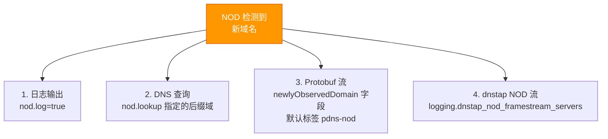
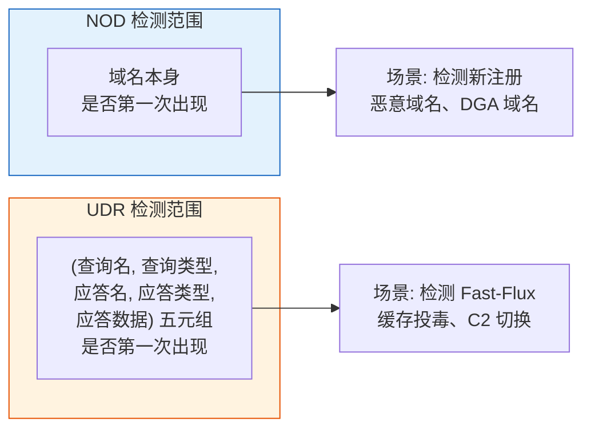
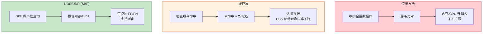
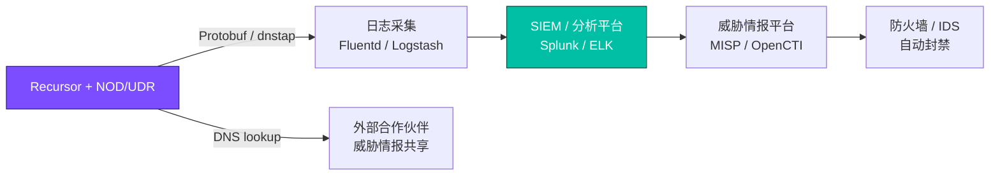

# PowerDNS Recursor — NOD 新域名检测 与 UDR 独特响应

> 来源: https://doc.powerdns.com/recursor/nod_udr.html
> 相关文档: [配置参数参考](powerdns-recursor-settings-reference.md)、[性能调优指南](powerdns-recursor-performance-guide.md)

---

NOD (Newly Observed Domain) 和 UDR (Unique Domain Response) 是 Recursor 内建的
**概率性安全监控功能**，使用稳定布隆过滤器 (Stable Bloom Filter, SBF) 以极低的
内存和 CPU 开销检测潜在的安全威胁。

---

## 一、NOD — 新域名检测

### 1.1 概述

**用途**: 检测从未见过的域名，识别可能与恶意软件、钓鱼、僵尸网络 C2 相关的可疑活动。

传统方法需要维护所有已知域名的数据库做确定性比对，在递归解析器中不可扩展。
NOD 使用**稳定布隆过滤器 (SBF)** 作为概率性数据结构：

| 特性 | 说明 |
|------|------|
| 数据结构 | Stable Bloom Filter |
| 默认大小 | 67,108,864 个 cell |
| 内存消耗 | 每个 cell 1 bit（每条线程） |
| 磁盘消耗 | 每个 cell 1 byte（持久化） |
| 可能误差 | 存在假阳性（FP）和假阴性（FN） |
| 持久化 | 定期写入 `nod.history_dir` |

> **注意**: 首次启用时**所有域名都会被视为新域名**。建议运行至少 **一周**后再使用检测结果。

### 1.2 配置

```yaml
nod:
  # 启用新域名追踪
  tracking: true

  # SBF 数据库大小（cell 数）。增大可降低 FP/FN 率。
  db_size: 67108864

  # 持久化目录（重启后保留历史记录）
  history_dir: '/var/lib/pdns-recursor/nod'

  # 快照写入间隔（秒），0 禁用
  db_snapshot_interval: 600

  # 是否在日志中记录新域名
  log: true

  # 忽略列表 — 这些域名及其子域永远不会被视为新域名
  # 适用于内部域名、已知的频繁变化域名
  ignore_list:
    - 'internal.example.com'
    - 'cdn.example.net'

  # 从文件加载忽略列表（每行一个域名）
  # ignore_list_file: '/etc/powerdns/nod_ignore.txt'

  # 新域名检测时触发 DNS 查询（用于与合作伙伴共享威胁情报）
  # 例如 lookup: 'nod.monitoring.com'
  # → 检测到 new.evil.com 时查询 new.evil.com.nod.monitoring.com
  # lookup: ''

  # Protobuf 日志中的标签名
  pb_tag: 'pdns-nod'
```

> **安全注意**: `lookup` 功能会将新域名发送给外部合作伙伴，注意不要泄露内部域名。

### 1.3 NOD 信息输出方式



**日志格式示例:**
```
Jul 18 11:31:25 Newly observed domain nod=sdfoijdfio.com
```

### 1.4 调优建议

| 场景 | 建议 |
|------|------|
| 高流量环境 | 增大 `db_size` 降低 FP 率 |
| 内存受限 | 减小 `db_size`（如 33554432），接受更高 FP 率 |
| 强制重启容忍 | 确保 `db_snapshot_interval` < 重启间隔 |
| 排除内部域名 | 务必配置 `ignore_list`，否则内部域名全被标记为新域名 |
| 首次部署 | 启用后等待 1~2 周再参考结果 |

---

## 二、UDR — 独特域名响应

### 2.1 概述

**用途**: 检测某个域名返回的 DNS 响应组合是否前所未见。

UDR 追踪 **(查询名, 查询类型, 应答名, 应答类型, 应答数据)** 五元组的唯一性。
这有助于识别：

| 威胁类型 | UDR 检测原理 |
|----------|-------------|
| **Fast-Flux 域名** | 同一域名的 A 记录频繁变化 → 大量独特响应 |
| **缓存投毒攻击** | 异常的新响应数据出现 |
| **僵尸网络 C2** | C2 域名使用快速变化的 IP |
| **域名劫持** | 域名突然返回不同的 IP 段 |

正常的行为良好的域名通常返回**稳定**的 DNS 响应。不稳定的响应模式可能是可疑信号。

### 2.2 配置

```yaml
nod:
  # 启用独特响应追踪
  unique_response_tracking: true

  # UDR 布隆过滤器大小
  unique_response_db_size: 67108864

  # UDR 持久化目录
  unique_response_history_dir: '/var/lib/pdns-recursor/udr'

  # 是否在日志中记录独特响应
  unique_response_log: true

  # UDR 忽略列表 — 这些域名不参与 UDR 检测
  unique_response_ignore_list:
    - 'cdn.example.com'
    - 'dyn.example.net'

  # 从文件加载 UDR 忽略列表
  # unique_response_ignore_list_file: '/etc/powerdns/udr_ignore.txt'

  # Protobuf 日志中的 UDR 标签
  unique_response_pb_tag: 'pdns-udr'
```

### 2.3 UDR 日志格式

```
Oct 24 12:11:27 Unique response observed: qname=foo.com qtype=A rrtype=AAAA rrname=foo.com rrcontent=1.2.3.4
```

字段含义：
- `qname`: 客户端查询的域名
- `qtype`: 查询的记录类型
- `rrname`: 应答中的资源记录名称
- `rrtype`: 应答中的资源记录类型
- `rrcontent`: 应答中的资源记录数据

---

## 三、NOD vs UDR 对比



| 维度 | NOD | UDR |
|------|-----|-----|
| 检测对象 | 域名是否前所未见 | 应答组合是否前所未见 |
| 典型威胁 | DGA 域名、新注册恶意域名 | Fast-Flux、缓存投毒、C2 IP 切换 |
| 误报来源 | 内部域名、CDN 动态子域 | 负载均衡、CDN、GeoDNS 的正常变化 |
| 内存/磁盘 | 独立 SBF | 独立 SBF（与 NOD 分离） |
| 默认状态 | 关闭 | 关闭 |

---

## 四、SBF 原理与调优

### 4.1 稳定布隆过滤器

不同于传统布隆过滤器（只能插入不能删除），SBF 通过**老化机制**支持删除旧条目，
确保长期运行时不会饱和。

```
传统布隆过滤器:        insert → 饱和 → FP 率上升（无法删除）
稳定布隆过滤器 (SBF):  insert + 定期老化 → 旧数据淘汰 → FP 率稳定
```

### 4.2 容量规划

默认 67,108,864 cells（约 67M）：

| 资源 | 每 cell | 总消耗 |
|------|---------|--------|
| 内存（每条 worker 线程） | 1 bit | ~8 MB |
| 磁盘（持久化文件） | 1 byte | ~64 MB |

**计算公式:**

```
假阳性率 ≈ (1 - e^(-k*n/m))^k

其中:
  m = cell 数 (db_size)
  n = 已插入条目数
  k = hash 函数数 (SBF 固定)
```

增大 `db_size` 可降低 FP/FN 率，但增加内存开销。

### 4.3 持久化

- SBF 数据每 `db_snapshot_interval` 秒（默认 600）写入磁盘一次
- 启动时从磁盘恢复历史数据
- 修改 `db_size` 后必须**删除**持久化目录中的旧文件

---

## 五、完整配置示例

```yaml
# 企业级 NOD + UDR 配置
nod:
  # ======== NOD 新域名检测 ========
  tracking: true
  db_size: 134217728                       # 加大到 128M cells 降低 FP
  history_dir: '/var/lib/pdns-recursor/nod'
  db_snapshot_interval: 300                # 5 分钟快照
  log: true                                # 记录到日志
  
  # 忽略内部域名和已知的动态域名
  ignore_list:
    - 'internal.mycompany.com'
    - 'cdn.trusted-cdn.com'
  
  # 向安全团队上报（可选）
  # lookup: 'nod.security.mycompany.com'
  
  pb_tag: 'pdns-nod'

  # ======== UDR 独特响应 ========
  unique_response_tracking: true
  unique_response_db_size: 134217728       # 与 NOD 相同大小
  unique_response_history_dir: '/var/lib/pdns-recursor/udr'
  unique_response_log: true
  
  unique_response_ignore_list:
    - 'cdn.trusted-cdn.com'                # CDN 节点 IP 频繁变化，排除
    - 'dyn.loadbalancer.com'               # 负载均衡器
```

---

## 六、监控与运维

### 6.1 检查状态

```bash
# 查看 NOD/UDR 相关指标
rec_control get-all | grep -E 'nod|udr|unique'

# 关键指标:
#   new-domain-count        — 检测到的新域名总数
#   unique-response-count   — 检测到的独特响应总数
```

### 6.2 日常操作

```bash
# 清空 NOD 数据库（重新开始学习）
# 方法: 停止 Recursor，删除持久化文件，重启
rm -rf /var/lib/pdns-recursor/nod/*
systemctl restart pdns-recursor

# 同样清空 UDR
rm -rf /var/lib/pdns-recursor/udr/*

# 重载配置
rec_control reload-yaml
```

### 6.3 常见问题

| 问题 | 原因 | 解决 |
|------|------|------|
| 所有域名都标记为新 | 首次启用，SBF 为空 | 运行 1~2 周后自动缓解 |
| 内部域名频繁触发 | 未配置 `ignore_list` | 添加内部域到忽略列表 |
| FP 率过高 | `db_size` 太小 | 增大 `db_size` 并清空旧数据 |
| 重启后数据丢失 | 持久化目录权限问题 | 检查 `history_dir` 权限 |
| 磁盘空间不足 | SBF 持久化文件过大 | 增大快照间隔或减小 `db_size` |

---

## 七、与传统方法的对比



---

## 八、集成到安全工作流


