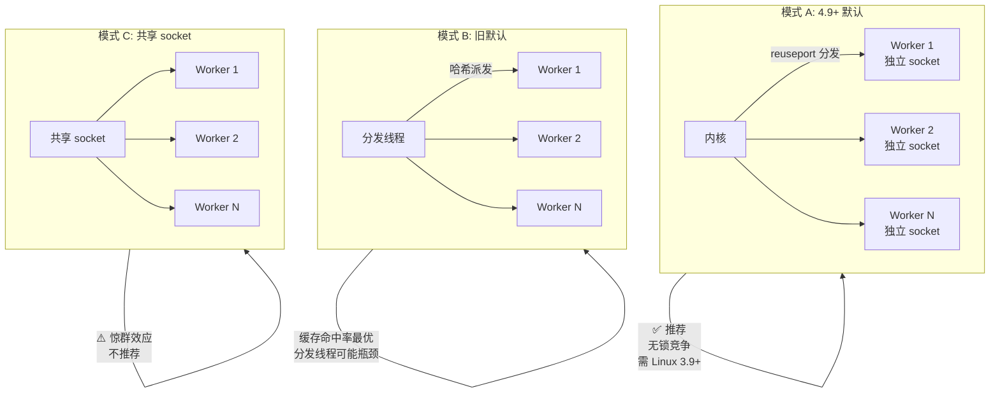
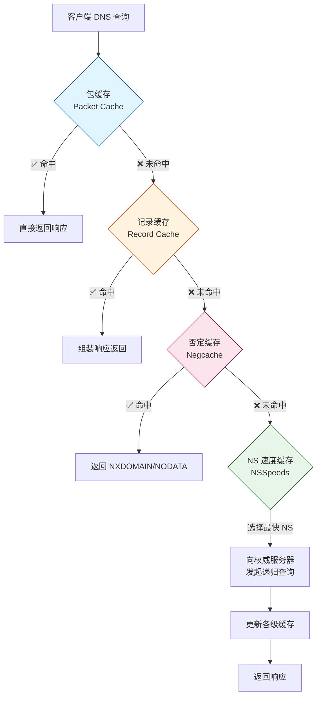
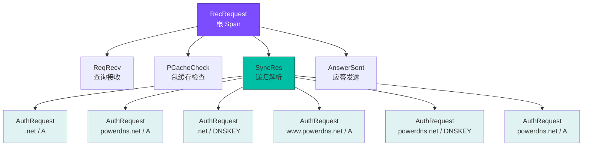

# PowerDNS Recursor — 性能调优指南

> 来源: https://doc.powerdns.com/recursor/performance.html
> 相关文档: [配置参数参考](powerdns-recursor-settings-reference.md)、[主配置入口](recursor.yml)、[递归行为配置](recursor.d/06-recursor.yml)

---

## 目录

1. [基础知识](#一基础知识)
2. [线程模型与查询分发](#二线程模型与查询分发)
3. [MTasker 与 MThreads](#三mtasker-与-mthreads)
4. [缓存体系](#四缓存体系)
5. [内存使用](#五内存使用)
6. [连接跟踪与防火墙](#六连接跟踪与防火墙)
7. [TCP 调优与乱序处理](#七tcp-调优与乱序处理)
8. [TCP Fast Open](#八tcp-fast-open-支持)
9. [本地根区 (RFC 8806)](#九本地根区-rfc-8806)
10. [性能度量](#十性能度量)
11. [事件追踪与 OpenTelemetry](#十一事件追踪与-opentelemetry)

---

## 一、基础知识

### 1.1 文件描述符限制

高负载的递归服务器可能需要大量文件描述符：

| 操作系统 | 默认限制 | 建议 |
|----------|----------|------|
| Linux | 1024 | 通常够用，高负载时提升 |
| Solaris | 256 | **必须提升** |
| FreeBSD | 足够高 | 无需调整 |

**提升方法：**

```bash
# 临时提升
ulimit -n 65536

# systemd 持久化: 在 unit 文件中添加
# LimitNOFILE=65536
```

### 1.2 CPU 架构与编译

- **x86_64**: 运行 64 位二进制可获得近 **2 倍**性能提升
- **UltraSPARC**: 64 位无额外收益
- **Profiled Build**: 使用 `gprof` 做剖面引导编译，某些场景可提升 **20%** 性能

### 1.3 基本调优建议

| 设置 | 建议值 | 说明 |
|------|--------|------|
| `recursor.threads` | CPU 核心数 - 分发线程数 | 不要超过物理核心 |
| `recordcache.max_entries` | 数百万即可 | 超过此值命中率不再显著提升，反而增加 CPU 缓存未命中 |
| `net.ipv6.route.max_size` | 增大 | IPv6 大规模部署时需要检查 |

---

## 二、线程模型与查询分发

### 2.1 三种工作模式

自 4.9.0 起默认行为发生变化：



**关键参数：**

| 参数 | 4.9+ 默认 | 说明 |
|------|-----------|------|
| `incoming.reuseport` | `true` | 需要 Linux 3.9+ 内核 |
| `incoming.pdns_distributes_queries` | `false` | 4.9 起不推荐分发线程模式 |
| `incoming.distributor_threads` | 1 | 当 pdns_distributes_queries=true 时启用 |

### 2.2 线程不均衡问题

在使用 `dnsdist` 等代理时，如果代理只使用少数源端口，内核可能将大多数查询分配给同一个 worker 线程，造成严重不均衡。

**诊断：**
```
Jun 26 11:06:41 ... count="7" thread="0"
Jun 26 11:06:41 ... count="535167" thread="1"    # ← 严重不均衡！
Jun 26 11:06:41 ... count="5" thread="2"
```

**解决方案：**

1. **dnsdist 用户**: 增大 `newServer` 的 `sockets` 参数，起始建议为 Recursor 线程数的 **2 倍**
2. **非 Linux 系统**: `reuseport` 可能无效，尝试切回 `pdns_distributes_queries=true`
3. **NUMA 优化**: 使用 `recursor.cpu_map` 将 worker 线程绑定到特定 CPU

### 2.3 CPU 亲和性绑定

```yaml
# 线程 0 绑定 CPU 0, 线程 1 绑定 CPU 1 和 2
recursor:
  cpu_map: '0=0 1=1,2'
```

线程 ID 编号规则：
- ID 0: 控制通道 + Web 服务器 + 内部任务
- ID 1+: 分发线程（如有）
- 随后: worker 线程

---

## 三、MTasker 与 MThreads

### 3.1 什么是 MTasker

PowerDNS Recursor 使用用户态协作式多任务调度器 `MTasker`，基于 `boost::context`（推荐）或 System V `ucontexts`（较慢）。请确保系统支持 `boost::context` 以获得最佳性能。

### 3.2 关键参数

| 参数 | 默认值 | 说明 |
|------|--------|------|
| `recursor.max_mthreads` | 2048 | **每 worker 线程**的最大并发 mthread 数 |
| `recursor.stack_size` | 200000 (200KB) | 每个 mthread 的栈大小 |
| `recursor.stack_cache_size` | 100(≥4.9) | **每线程**缓存的栈数量（复用减少分配开销） |

### 3.3 全局 mthread 上限计算

```
全局最大 mthread = (distributor_threads + worker_threads) × max_mthreads
```

### 3.4 vm.max_map_count 内核参数

每个 mthread 栈可能占用最多 3 个内存映射。4.9+ 版本需要检查内核参数：

```bash
# 建议值: 至少 4 × (threads + 2) × max-mthreads
# 例如: 4 × (4 + 2) × 2048 = 49152
sysctl vm.max_map_count
```

大多数发行版默认约 100 万（足够），但有些仅 64K（大型部署可能不够）。

### 3.5 监控 mthread 使用

| 指标 | 含义 |
|------|------|
| `concurrent-queries` | 当前活跃的 mthread 数 |
| `over-capacity-drops` | 因 mthread 不足而丢弃的查询数 |

如果 `over-capacity-drops` 持续增长，需要增加 `max_mthreads` 或 `threads`。

---

## 四、缓存体系

PowerDNS Recursor 有四层缓存：



**重要**: 包缓存最先被查询。高包缓存命中率会自然降低后续缓存的命中率——这是正常现象。

### 缓存内存估算

| 缓存类型 | 每条目内存 | 示例 |
|----------|-----------|------|
| 包缓存 (Packet Cache) | ~500 字节 | 100 万条目 ≈ 500 MB |
| 记录缓存 (Record Cache) | ~850 字节 | 200 万条目 ≈ 1.7 GB |

**示例**: 200 万记录缓存 + 100 万包缓存 ≈ **2.2 GB**

---

## 五、内存使用

### 5.1 内存占用来源

默认配置、缓存满时约使用 **1 GB+**。大型部署可能达到数 GB。主要内存消费者：

1. **包缓存** — 每个条目约 500 字节
2. **记录缓存** — 每个条目约 850 字节
3. **权威 Zone** — 取决于加载的 zone 数量和大小
4. **RPZ Zone** — 取决于加载的 RPZ 数量和大小
5. **NOD 数据库** — 取决于布隆过滤器大小配置

### 5.2 ⚠️ 严禁交换 (Swap)

> Recursor 的内存访问模式是**随机**的。如果物理内存不足导致 swap，系统将陷入严重的颠簸 (thrashing)，性能崩溃。

**建议:**
- 确保物理内存 > 预期最大缓存占用 + 2GB 系统开销
- 使用 `swapoff` 或设置 `vm.swappiness=0` 减少 swap 倾向

---

## 六、连接跟踪与防火墙

### 6.1 问题

高负载 Recursor（数千 QPS）会对有状态防火墙的连接跟踪表造成巨大压力，甚至导致防火墙失效。

### 6.2 解决方案: NOTRACK 规则

**iptables (Linux):**

```bash
# IPv4 — UDP 53 端口跳过连接跟踪
iptables -t raw -I OUTPUT -p udp --sport 53 -j CT --notrack
iptables -t raw -I PREROUTING -p udp --dport 53 -j CT --notrack
iptables -I INPUT -p udp --dport 53 -j ACCEPT

# IPv6
ip6tables -t raw -I OUTPUT -p udp --sport 53 -j CT --notrack
ip6tables -t raw -I PREROUTING -p udp --dport 53 -j CT --notrack
ip6tables -I INPUT -p udp --dport 53 -j ACCEPT
```

**FirewallD (CentOS 7+/RHEL 7+/Fedora 21+):**

```bash
# IPv4
firewall-cmd --direct --add-rule ipv4 raw OUTPUT 0 -p udp --sport 53 -j CT --notrack
firewall-cmd --direct --add-rule ipv4 raw PREROUTING 0 -p udp --dport 53 -j CT --notrack
firewall-cmd --direct --add-rule ipv4 filter INPUT 0 -p udp --dport 53 -j ACCEPT

# IPv6
firewall-cmd --direct --add-rule ipv6 raw OUTPUT 0 -p udp --sport 53 -j CT --notrack
firewall-cmd --direct --add-rule ipv6 raw PREROUTING 0 -p udp --dport 53 -j CT --notrack
firewall-cmd --direct --add-rule ipv6 filter INPUT 0 -p udp --dport 53 -j ACCEPT

# 永久生效: 加上 --permanent 标志
```

> **注意**: 上述规则仅针对 UDP 53。TCP 53 仍走正常防火墙规则。

---

## 七、TCP 调优与乱序处理

### 7.1 版本变更

| 版本 | TCP 处理方式 |
|------|-------------|
| < 5.0.0 | TCP 查询由 distributor 或 worker 线程处理 |
| ≥ 5.0.0 | **专用 TCP 线程** (`recursor.tcp_threads`) 处理 TCP 查询 |

### 7.2 乱序处理 (Out-of-Order)

Recursor 对 TCP 连接上的多个查询进行并发处理。每个查询独立进行，完成后**立即发送响应**，无需等待先收到的查询先完成。这避免了单个慢查询阻塞其他查询。

### 7.3 TCP mthread 消耗计算

**< 5.0.0:**
```
TCP mthread 消耗 = max_tcp_clients × max_concurrent_requests_per_tcp_connection
```
此值应**远小于** `max_mthreads`，以保留足够的 mthread 给 UDP 查询。

**≥ 5.0.0:**
TCP 有独立线程池，不再与 UDP 争用 mthread。

### 7.4 调优建议

| 场景 | 策略 |
|------|------|
| 少量客户端、大并发 | 增大 `max_concurrent_requests_per_tcp_connection` |
| 大量客户端 | 增大 `max_tcp_clients`，减小 `max_concurrent_requests_per_tcp_connection` 防止 mthread 饥饿 |
| 任何场景 | 监控 `concurrent-queries` 和 `over-capacity-drops` |
| 单客户端防护 | 设置 `max_tcp_per_client` 限制 |

### 7.5 示例计算

场景: 200 个 TCP 客户端, max_mthreads=2048

```
max_concurrent_requests_per_tcp_connection = 5
最坏情况 mthread 占用 = 5 × 200 = 1000
剩余约 1048 给 UDP 查询 ✓
```

### 7.6 监控指标

| 指标 | 含义 |
|------|------|
| `tcp-clients` | 当前 TCP 连接数 |
| `tcp-client-overflow` | 因单客户端连接数超限而被拒绝的连接数 |

---

## 八、TCP Fast Open 支持

### 8.1 原理

TCP Fast Open (TFO, RFC 7413) 允许在 TCP 三次握手的 SYN 包中携带数据，节省一次往返时间 (RTT)。

### 8.2 配置

**内核参数:**
```bash
# 0=禁用, 1=仅主动(出站), 2=仅被动(入站), 3=两者
sysctl net.ipv4.tcp_fastopen=3
```

**Recursor:**
```yaml
incoming:
  tcp_fast_open: 16       # 入站 (被动) TFO 队列大小, ≥4.1
outgoing:
  tcp_fast_open_connect: true  # 出站 (主动) TFO, ≥4.5
```

### 8.3 监控

```bash
netstat -s | grep TCPFastOpen
```

| 内核指标 | 含义 |
|----------|------|
| `TCPFastOpenListenOverflow` | TFO 队列溢出次数 — 需增大 `incoming.tcp_fast_open` |
| `TCPFastOpenBlackHole` | 主动 TFO 被黑洞的次数 |

### 8.4 已知问题与解决

1. **Google 部分 NS 服务器**: TFO cookie 发送后不接受，每次都发新 cookie（Google 正在修复）
2. **主动 TFO 黑洞**: Linux 内核可能在多次失败后停止主动 TFO。设置 `net.ipv4.tcp_fastopen_blackhole_timeout_sec=0` 规避
3. **Anycast 部署**: 所有节点必须共享相同的 TFO Key:
   ```bash
   sysctl net.ipv4.tcp_fastopen_key=<共享密钥>
   ```

---

## 九、本地根区 (RFC 8806)

运行本地根区副本可减少到根服务器的流量并降低客户端响应延迟。

### 9.1 方案一: 本地权威服务器 + 转发

**步骤 1**: 配置本地 PowerDNS Authoritative Server 作为根区从服务器：

```bash
# ip1 和 ip2 是提供根区 AXFR 的服务器（RFC 8806 附录 A 列出了候选）
pdnsutil create-secondary-zone . ip1 ip2
```

**步骤 2**: 在 Recursor 中配置转发：

```yaml
# YAML 配置
recursor:
  forward_zones:
    - zone: '.'
      forwarders:
        - '<权威服务器IP>'
```

Recursor 会向本地权威查询根区，但仍然遵循其中发现的 delegations。

### 9.2 方案二: Zone to Cache

每个 Recursor 独立下载并缓存根区内容（≥4.6）：

```yaml
recordcache:
  zonetocaches:
    - zone: '.'
      method: url          # 或 axfr / file
      sources: ['https://example.com/root.zone']
      refreshPeriod: 86400
```

---

## 十、性能度量

### 10.1 关键监控指标

Recursor 暴露大量[指标](https://doc.powerdns.com/recursor/metrics.html)可供 Grafana 等工具监控。核心指标：

| 类别 | 指标 | 说明 |
|------|------|------|
| QPS | `questions` | 收到的查询总数 |
| 缓存 | `packetcache-hit` / `packetcache-miss` | 包缓存命中/未命中 |
| 缓存 | `cache-hits` / `cache-misses` | 记录缓存命中/未命中 |
| 线程 | `concurrent-queries` | 当前并发查询数 |
| 线程 | `over-capacity-drops` | 超容量丢弃数 |
| TCP | `tcp-clients` | 当前 TCP 连接数 |
| TCP | `tcp-client-overflow` | TCP 客户端溢出 |
| 延迟 | `qa-latency` | 平均查询-应答延迟 |
| DNSSEC | `dnssec-*` | DNSSEC 验证统计 |

### 10.2 统计输出示例

每隔 `logging.statistics_interval` 秒（默认 1800），Recursor 输出周期性统计摘要：

```
msg="Queries handled by thread" count="535167" thread="1"
msg="Questions" count="1500000"
msg="Cache hits" count="1200000"
msg="Packet cache hits" count="800000"
```

---

## 十一、事件追踪与 OpenTelemetry

### 11.1 Event Tracing (≥4.6，实验性功能)

事件追踪记录查询处理的内部步骤细节，可导出到：
- Protobuf 日志
- 日志文件
- OpenTelemetry Traces (≥5.3)

**启用:**
```yaml
recursor:
  event_trace_enabled: 6   # 2(日志) + 4(OTel) = 6
```

**事件类型一览：**

| 事件 | 值范围 | 说明 |
|------|--------|------|
| `CustomEvent` | 0 | 自定义事件 |
| `ReqRecv` | 1 | 收到请求 |
| `PCacheCheck` | 2 | 包缓存查询 (value: bool 命中) |
| `AnswerSent` | 3 | 应答已发送 |
| `SyncRes` | 100 | 递归解析主函数 (value: int rcode) |
| `LuaGetTag` | 101 | Lua gettag hook |
| `LuaIPFilter` | 103 | Lua IP 过滤 hook |
| `LuaPreRPZ` | 104 | Lua RPZ 前 hook |
| `LuaPreResolve` | 105 | Lua 解析前 hook |
| `LuaPreOutQuery` | 106 | Lua 出站查询前 hook |
| `LuaPostResolve` | 107 | Lua 解析后 hook |
| `LuaNoData` | 108 | Lua NODATA hook |
| `LuaNXDomain` | 109 | Lua NXDOMAIN hook |

### 11.2 事件追踪示例

**包缓存未命中 → 递归解析:**
```
- ReqRecv(70);
- PCacheCheck(411964);         # 开始
- PCacheCheck(416783,0,done);  # 结束, 结果=0(未命中)
- SyncRes(441811);             # 开始递归
- SyncRes(337233971,0,done);   # 结束, rcode=0(NOERROR)
- AnswerSent(337266453)
```

**包缓存命中:**
```
- ReqRecv(60);
- PCacheCheck(22913);
- PCacheCheck(113255,1,done);  # 结果=1(命中)
- AnswerSent(117493)
```

### 11.3 OpenTelemetry Traces (≥5.3/5.4)

**启用方式:**

设置 `recursor.event_trace_enabled=4` 并使用 `logging.opentelemetry_trace_conditions` 控制哪些查询生成 Trace。

**追踪条件配置 (≥5.4):**

```yaml
recursor:
  event_trace_enabled: 4

logging:
  protobuf_servers:
    - servers: ['127.0.0.1:9999']
  opentelemetry_trace_conditions:
    # 条件 1: 所有来自 127.0.0.1 或 ::1 的查询生成 Trace
    - acls: ['127.0.0.1', '::1']
    # 条件 2: 来自特定子网 + qname/qtype/qid 匹配
    - acls: ['192.168.178.0/24']
      qnames: ['a.very.specific.suffix']     # 后缀匹配
      qtypes: ['A', 'AAAA']                  # 仅这些记录类型
      qid: 1234                              # 精确匹配查询 ID
      edns_option_required: true             # 需要 EDNS 选项中的 TraceID
```

**条件匹配规则:**
- `acls`: 客户端 IP 必须匹配（必选）
- `qnames`: DNS 名称后缀匹配
- `qtypes`: QType 必须在列表中
- `qid`: 精确匹配查询 ID
- `edns_option_required`: 需要 EDNS TraceID 选项
- `traceid_only`: 仅提取 TraceID 放入 Protobuf，不产生完整 trace 数据

**生成所有查询的 Trace (兼容 5.3.x 行为):**
```yaml
logging:
  opentelemetry_trace_conditions:
    - acls: ['0.0.0.0/0', '::/0']
```

**仅对特定 IP 生成完整 Trace，其余只提取 TraceID:**
```yaml
logging:
  opentelemetry_trace_conditions:
    - acls: ['0.0.0.0/0', '::/0']
      traceid_only: true
    - acls: ['127.0.0.1']
```

**在 DNS 查询中携带 TraceID:**
```bash
# EDNS 选项 65500 + TraceID (16 字节 = 32 hex 字符)
dig +ednsopt=65500:00000102030405060708090a0b0c0d0e0fff example.com

# 附加 parent SpanID (8 字节 = 16 hex 字符)
dig +ednsopt=65500:0000<traceID_32hex><parentSpanID_16hex> example.com
```

### 11.4 OpenTelemetry Trace 结构

生成的 Trace 包含以下 Span 层级：



---

## 附录: 快速调优清单

### 启动前检查

- [ ] `ulimit -n` 至少 4096（高负载 65536）
- [ ] `sysctl vm.max_map_count` 至少 `4 × (threads + 2) × max-mthreads`
- [ ] `sysctl net.ipv6.route.max_size`（IPv6 部署时）
- [ ] 物理内存 > 预期缓存占用 + 2GB
- [ ] 禁用 swap 或 `vm.swappiness=0`

### 线程配置

- [ ] `recursor.threads` = CPU 核心数
- [ ] 4.9+ 使用默认 `reuseport=true, pdns_distributes_queries=false`
- [ ] 前端使用 dnsdist 时增加 `sockets` 参数

### 防火墙

- [ ] UDP 53 端口配置 NOTRACK 规则
- [ ] TCP 53 端口保留正常规则

### 监控

- [ ] 监控 `over-capacity-drops`（应为 0）
- [ ] 监控 `tcp-client-overflow`（应为 0）
- [ ] 监控线程均衡（各线程查询数相近）
- [ ] 监控 `packetcache-hit` 和 `cache-hits` 比率

---
